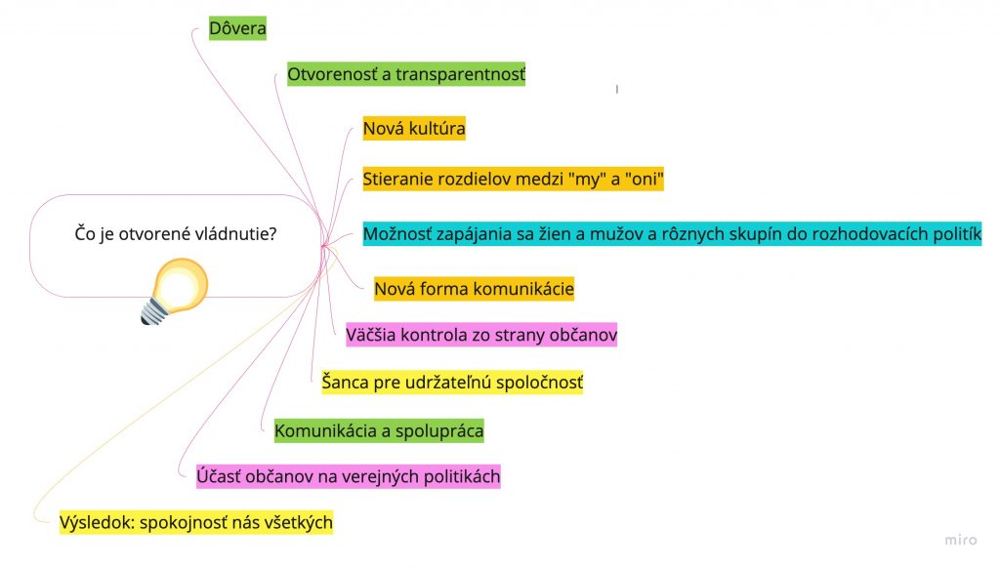
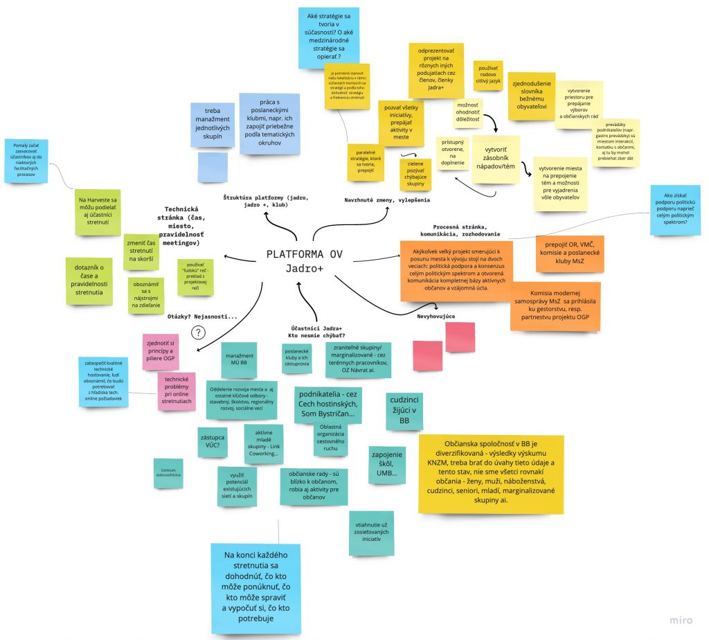

Druhé diskusné podujatie Iniciatívy Partnerstva pre otvorené vládnutie v Banskej Bystrici sa uskutočnilo **31. marca 2021** prostredníctvom online platformy Zoom. Zúčastnilo sa ho **22 aktérov z mestského úradu a občianskej spoločnosti**.

---

### 🎯 Cieľ stretnutia

Hlavným cieľom bolo:
- **uviesť do života Platformu Partnerstva pre otvorené vládnutie**,
- a diskutovať o úlohách členov tzv. **skupiny Jadro+**, ktorá bude motorom participatívneho procesu pri tvorbe akčného plánu.

---

### 🧩 Kľúčové výstupy

Z diskusie a skupinovej práce vzišli dôležité oblasti, ktoré budú podporovať tvorbu akčného plánu otvoreného vládnutia:

- Stratégia pre zapájanie rôznych skupín (mladí ľudia, zraniteľné skupiny, podnikatelia, poslanci, vedenie mesta)
- Technická podpora pre online stretnutia a digitálne nástroje
- Jednoduchší, zrozumiteľný a rodovo citlivý jazyk
- Spoločné “zbieranie úrody” – vizualizované zápisy a interpretácie z diskusií
- Zber informácií „čo sa deje v meste“ (projekty na MsÚ aj v občianskom sektore)
- Strategické ukotvenie OGP vo vzťahu k aktuálnym mestským a národným koncepciám (UMR, Smart samospráva, Operačné programy, AGENDA 2020, EÚ rámce)

---

### ✋ Zapojenie účastníkov

Účastníci boli vyzvaní, aby sa **stali spolu-vlastníkmi vybraných aktivít** podľa svojich možností a záujmu – pridaním mena k jednotlivým oblastiam v zdieľanom dokumente. Vítaná je aj iniciatíva zo strany účastníkov – návrhy stretnutí, spôsobov práce či metodických prístupov.

---

### 📢 Komunikácia a výstupy

- Vizualizovaný zápis zo stretnutia spracovaný a zverejnený pre všetkých.
 

- Pozvánky a výstupy budú priebežne dostupné na **facebookovej stránke Iniciatívy pre lokálne otvorené vládnutie v Banskej Bystrici**.
---

**Ďakujeme všetkým účastníkom za ich aktivitu, nápady a ochotu spoluvytvárať kultúru otvoreného vládnutia v našom meste!**

